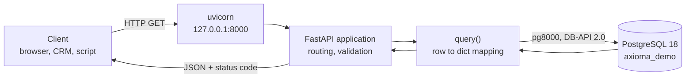

# Integration API — Build and Run

The second consumer of `axioma_demo` is a REST service. Where Power BI connects
directly to the database, this layer places a contract between the data and its
consumers: callers receive JSON over HTTP and never learn the schema underneath.

This page covers building and running it. The contract itself is documented
separately in the [API Reference](./api-reference.mdx).

---

## Why a service and not a database connection

Giving an external system database credentials couples it to the physical schema.
Renaming a column then breaks the consumer, and there is no way to find out who is
affected before it happens.

| | Direct database access | REST API |
|---|---|---|
| Consumer depends on | table and column names | endpoint and field names |
| Schema change | breaks consumers immediately | absorbed by the service |
| Access control | database roles, all-or-nothing per table | per endpoint, per field, per row |
| Auditing | database logs | application logs with caller identity |
| Available to | anything with a driver and network route | anything that speaks HTTP |

The service is a translation layer whose purpose is to let the database change
without permission from everyone who reads it.

---

## Architecture



| Layer | Responsibility |
|---|---|
| **uvicorn** | ASGI server. Accepts TCP connections and speaks HTTP. |
| **FastAPI** | Routing, parameter parsing and validation, error responses, OpenAPI generation. |
| **`query()`** | Opens a connection, executes SQL, converts rows to dictionaries, closes the connection. |
| **pg8000** | The PostgreSQL wire-protocol driver. |

---

## Environment setup

### 1. Install Python

In PowerShell, run as administrator:

```powershell
winget install -e --id Python.Python.3.13
```

Then **close PowerShell and open a new window**. A running shell does not pick up
changes to `PATH`, so `pip` and `python` remain unrecognised in the session that
performed the installation. This produces a `CommandNotFoundException` that looks
like a failed install and is not one.

Verify:

```powershell
python --version
```

If installing from [python.org](https://www.python.org/downloads/) instead, the
checkbox **Add python.exe to PATH** on the first installer screen is mandatory. It is
cleared by default.

### 2. Install the dependencies

```powershell
pip install fastapi uvicorn pg8000
```

### 3. Verify

```powershell
pip list
```

`fastapi`, `uvicorn` and `pg8000` must all appear.

---

## Driver selection

The standard PostgreSQL driver for Python is `psycopg2`, normally installed as
`psycopg2-binary`. **On this environment it cannot be used.**

`psycopg2-binary` distributes precompiled wheels for Windows x64. No wheel is
published for Windows **ARM64**, so `pip` falls back to building from source, which
requires a C toolchain and the PostgreSQL client headers — neither present on a clean
guest. The install fails during the build step.

`pg8000` is a pure-Python implementation of the PostgreSQL wire protocol. It has no
compiled extension, installs anywhere Python runs, and exposes the same DB-API 2.0
interface, so the two are interchangeable at the call site:

| | `psycopg2` | `pg8000` |
|---|---|---|
| Implementation | C extension over libpq | pure Python |
| Windows ARM64 wheel | none | not needed |
| Interface | DB-API 2.0 | DB-API 2.0 |
| Parameter style | `%s` | `%s` |
| Dictionary rows | `RealDictCursor` | mapped manually from `cursor.description` |
| Throughput | higher | adequate for this workload |

The only functional difference is dictionary rows, handled by the four lines in
`query()` below.

---

## Source

Create a project directory and the application file:

```powershell
mkdir C:\Users\Oleh\axioma-api
cd C:\Users\Oleh\axioma-api
notepad api.py
```

`api.py`:

```python
from fastapi import FastAPI, HTTPException
import pg8000.dbapi

app = FastAPI(title="Axioma Demo API", version="1.0.0")

DB = dict(
    host="localhost",
    port=5432,
    database="axioma_demo",
    user="postgres",
    password="YOUR_PASSWORD",
)

def query(sql, params=()):
    conn = pg8000.dbapi.connect(**DB)
    try:
        cur = conn.cursor()
        cur.execute(sql, params)
        cols = [d[0] for d in cur.description]
        return [dict(zip(cols, row)) for row in cur.fetchall()]
    finally:
        conn.close()

@app.get("/hcp")
def list_hcp(limit: int = 50, offset: int = 0):
    rows = query(
        "SELECT * FROM healthcare_professionals ORDER BY id LIMIT %s OFFSET %s",
        (limit, offset),
    )
    return {"count": len(rows), "items": rows}

@app.get("/hcp/{hcp_id}")
def get_hcp(hcp_id: int):
    rows = query("SELECT * FROM healthcare_professionals WHERE id = %s", (hcp_id,))
    if not rows:
        raise HTTPException(status_code=404, detail="HCP not found")
    return rows[0]
```

### Notes on the implementation

**Parameterised SQL.** Values are passed as the second argument to `execute()`, never
concatenated into the statement. The driver sends them separately from the query
text, which makes SQL injection structurally impossible rather than merely unlikely.

**`finally: conn.close()`.** The connection is released whether the query succeeds or
raises. Without it, every failed request leaks a connection until PostgreSQL refuses
new ones.

**Type annotations drive behaviour.** `hcp_id: int` is not documentation. FastAPI
parses and validates the path segment against it and returns `422` automatically when
it is not an integer — see [error handling](./api-reference.mdx#errors).

**`ORDER BY id` before `LIMIT`.** Without an explicit ordering, PostgreSQL may return
rows in any order, and pagination over an unordered set can repeat or skip records.

---

## Running

```powershell
uvicorn api:app --reload
```

`api:app` names the module and the FastAPI instance inside it. `--reload` restarts the
server when the file changes and is a development-only flag.

Expected output:

```
INFO:     Uvicorn running on http://127.0.0.1:8000 (Press CTRL+C to quit)
```

The service runs for as long as the window stays open. `CTRL+C` stops it.

---

## Verification

Open `http://127.0.0.1:8000/docs`.


*Swagger UI, generated by FastAPI from the OpenAPI 3.1 description at `/openapi.json`.
Both endpoints are listed with their operation identifiers, and the validation error
schemas are documented without having been written by hand.*

Each endpoint expands to an interactive form. **Try it out** → **Execute** issues a
real request against the running service and displays the response — see
[the worked example](./api-reference.mdx#get-hcp).

| Address | Contents |
|---|---|
| `/docs` | Swagger UI — interactive |
| `/redoc` | ReDoc — reference-style rendering of the same description |
| `/openapi.json` | The machine-readable OpenAPI document |

> **Note — Generated output is not documentation**
>
> `/docs` is generated from type annotations. It states that `limit` is an integer with
> a default of 50; it cannot state what `limit` is *for*, what the maximum is, or what a
> caller should do when the result is empty. That is the difference between a schema and
> a document, and the reason [the API Reference](./api-reference.mdx) exists alongside it.

---

## Hardening

The service as written is a development build. Four changes separate it from a
deployable one, listed in the order they would be made.

| # | Change | Reason |
|---|---|---|
| 1 | Move `password` to an environment variable | A credential in source is a credential in version control |
| 2 | Replace per-request connections with a pool | Opening a TCP connection per request dominates response time under load |
| 3 | Add authentication | The service is currently open to anything that can reach the port |
| 4 | Cap `limit` and enforce a maximum | `limit=1000000` is a denial-of-service request |

---

## Troubleshooting

| Symptom | Cause | Resolution |
|---|---|---|
| `The term 'pip' is not recognized` | Python absent, or `PATH` not refreshed | Install Python; open a **new** PowerShell window |
| `psycopg2` fails to build | No ARM64 wheel | Use `pg8000` — see [Driver selection](#driver-selection) |
| `Error loading ASGI app` | Wrong working directory, or a typo in `api:app` | `cd` to the folder holding `api.py` |
| `password authentication failed` | Wrong password in `DB` | Correct the `password` value |
| `Connection refused` on startup | PostgreSQL service stopped | Start `postgresql-x64-18` in `services.msc` |
| `Address already in use` | Port 8000 occupied | `uvicorn api:app --port 8001` |
| `/docs` loads but requests return 500 | Database reachable, query failing | Read the uvicorn console; the traceback names the table or column |
