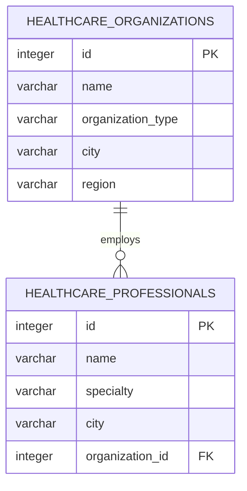

# Database Design — `axioma_demo`

`axioma_demo` is the reference-data store at the base of this project. It holds the
master list of healthcare professionals and the organisations they practise at, and
it is the single source that both the reporting layer and the API read from.


*pgAdmin 4 connected to PostgreSQL 18. Left: the object tree expanded to `Tables (4)`.
Right: `SELECT * FROM public.healthcare_organizations ORDER BY id ASC` returning all
five organisations, with column types shown in the grid header.*

---

## Installation

### 1. Install PostgreSQL

Download the Windows installer from
[postgresql.org/download/windows](https://www.postgresql.org/download/windows/) and
run it. During setup you are asked for a password for the `postgres` superuser —
this is the credential every later step needs, including the Power BI connection and
the API.

Accept the default port **5432** unless it is already occupied.

### 2. Verify the service is running

Before assuming anything is broken, confirm the database is actually up:

1. Press **Start**, type `services.msc`, press **Enter**.
2. Find the entry beginning `postgresql-x64-` followed by the version number.
3. The **Status** column must read `Running`. If it is blank, right-click → **Start**.

### 3. Create the database

Open **pgAdmin 4**, connect to the local server, and run:

```sql
CREATE DATABASE axioma_demo;
```

Then switch the query tool to `axioma_demo` before running the DDL below. Objects
created while connected to `postgres` land in the wrong database — a mistake that is
silent and costs ten minutes to find.

---

## Schema

### Entity relationship diagram



One organisation employs many professionals; each professional is attached to at most
one organisation. This is deliberately the simplest possible affiliation model, and
[the integration specification](./integration-spec.mdx#5-affiliations) explains why a
production reference database cannot keep it that way.

### DDL

```sql
CREATE TABLE healthcare_organizations (
    id                integer PRIMARY KEY,
    name              varchar(200) NOT NULL,
    organization_type varchar(100),
    city              varchar(100),
    region            varchar(100)
);

CREATE TABLE healthcare_professionals (
    id              integer PRIMARY KEY,
    name            varchar(200) NOT NULL,
    specialty       varchar(100),
    city            varchar(100),
    organization_id integer REFERENCES healthcare_organizations(id)
);
```

---

## Data dictionary

### `healthcare_organizations`

The HCO master list — hospitals and clinics.

| Column | Type | Key | Null | Description |
|---|---|---|---|---|
| `id` | `integer` | PK | no | Surrogate identifier. Referenced by `healthcare_professionals.organization_id`. |
| `name` | `varchar(200)` | | no | Registered name of the institution, e.g. `Central Medical Center`. |
| `organization_type` | `varchar(100)` | | yes | Category of institution. Current values: `Hospital`, `Clinic`. |
| `city` | `varchar(100)` | | yes | City of the primary address. |
| `region` | `varchar(100)` | | yes | Hungarian NUTS-2 statistical region, e.g. `Central Hungary`. Used as the grouping dimension in the Power BI report. |

**Rows:** 5

### `healthcare_professionals`

The HCP master list — individual practitioners. This is the table the
[Integration API](./api-reference.mdx) exposes.

| Column | Type | Key | Null | Description |
|---|---|---|---|---|
| `id` | `integer` | PK | no | Surrogate identifier. Appears as `hcp_id` in the API path. |
| `name` | `varchar(200)` | | no | Full name including title, e.g. `Dr. Anna Kovacs`. Stored as one field — see the note below. |
| `specialty` | `varchar(100)` | | yes | Medical specialty. Current values: `Cardiology`, `Oncology`, `Dermatology`. |
| `city` | `varchar(100)` | | yes | Practice location. May differ from the employer's city. |
| `organization_id` | `integer` | FK | yes | Employing HCO. Null means unaffiliated or not yet resolved. |

**Rows:** 8

> **Caution — Known modelling limitation**
>
> `name` is a single free-text column. A reference database cannot deduplicate reliably
> on a concatenated name — `Dr. Anna Kovacs` and `Kovacs Anna, MD` are the same person
> and will never match on string equality. Production schemas split `title`,
> `first_name`, `last_name` and add a normalised match key. This is recorded as a
> deliberate v1.0 simplification and addressed in the
> [matching rules](./integration-spec.mdx#4-record-matching).

### Out of scope for v1.0

The database also contains `pharmacies` and `products`. They are part of the wider
commercial data model but are not consumed by either integration documented here, so
they are excluded from this specification rather than half-documented.

---

## Sample data

`healthcare_organizations` — all five rows, as returned in the screenshot above:

| id | name | organization_type | city | region |
|---|---|---|---|---|
| 1 | Central Medical Center | Hospital | Budapest | Central Hungary |
| 2 | St. Margaret Clinic | Clinic | Budapest | Central Hungary |
| 3 | Debrecen Health Center | Hospital | Debrecen | Northern Great Plain |
| 4 | Szeged Medical Institute | Hospital | Szeged | Southern Great Plain |
| 5 | Pecs Regional Clinic | Clinic | Pecs | Southern Transdanubia |

`healthcare_professionals` — first four of eight, as returned by
`GET /hcp` in the [API reference](./api-reference.mdx#get-hcp):

| id | name | specialty | city | organization_id |
|---|---|---|---|---|
| 1 | Dr. Anna Kovacs | Cardiology | Budapest | 1 |
| 2 | Dr. Peter Nagy | Oncology | Budapest | 1 |
| 3 | Dr. Julia Horvath | Dermatology | Budapest | 2 |
| 4 | Dr. Mark Toth | Cardiology | — | — |

---

## Verification queries

Run these in the pgAdmin query tool after loading data. Each answers one question a
reviewer will actually ask.

**Is the data there at all?**

```sql
SELECT * FROM healthcare_professionals ORDER BY id;
```

**How is it distributed?** — this is the query behind the Power BI chart:

```sql
SELECT specialty, COUNT(*) AS doctors
FROM healthcare_professionals
GROUP BY specialty
ORDER BY doctors DESC;
```

**Does the join hold?** — professionals resolved to their employer:

```sql
SELECT p.name        AS professional,
       p.specialty,
       o.name        AS organization,
       o.region
FROM healthcare_professionals p
LEFT JOIN healthcare_organizations o ON o.id = p.organization_id
ORDER BY o.region, p.name;
```

A `LEFT JOIN` is used on purpose. An `INNER JOIN` would silently hide professionals
whose `organization_id` is null — precisely the records an integration needs to
surface, not conceal.

**Are there orphaned references?**

```sql
SELECT p.id, p.name, p.organization_id
FROM healthcare_professionals p
LEFT JOIN healthcare_organizations o ON o.id = p.organization_id
WHERE p.organization_id IS NOT NULL
  AND o.id IS NULL;
```

An empty result is the expected outcome; the foreign key should make it impossible.
The query exists because the constraint can be dropped during bulk loads and not
restored.

---

## Regenerating this data dictionary

The tables above are not maintained by hand. This query returns the live schema, and
its output is the source for the data dictionary:

```sql
SELECT table_name,
       ordinal_position,
       column_name,
       data_type,
       character_maximum_length,
       is_nullable,
       column_default
FROM information_schema.columns
WHERE table_schema = 'public'
ORDER BY table_name, ordinal_position;
```

Documentation that can be regenerated from the system it describes does not drift
away from it. Documentation that is retyped always does.
