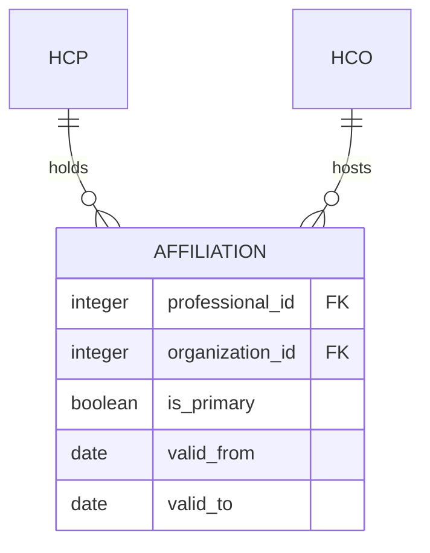
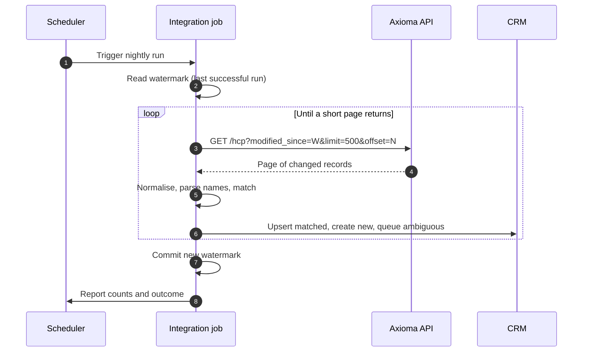
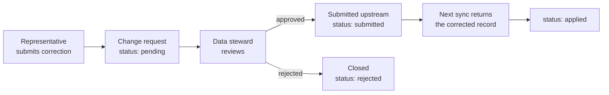

# Integration Specification — Reference Data to CRM

**Document type:** integration specification · **Version** 1.0 · **Status:** baseline

Specifies the flow of healthcare reference data from the master store into a
consuming CRM. Where the [API Reference](./api-reference.mdx) states what the
interface does, this document states what the integration must achieve and under
which rules.

---

## 1. Scope

### In scope

- Transfer of HCP and HCO records from the reference store to the CRM
- Identity, matching and deduplication rules
- Full and incremental synchronisation
- Change requests originating in the CRM and flowing back upstream
- Failure handling and reconciliation

### Out of scope

- Pharmacy and product data
- Consent and marketing-preference management
- Territory and target-list assignment
- Historical migration of pre-existing CRM records

### Systems

| Role | System | Interface |
|---|---|---|
| Source of record | `axioma_demo` (PostgreSQL 18) | [Integration API](./api-reference.mdx) |
| Consumer | CRM | REST client |
| Reporting | Power BI | [direct connection](./powerbi.mdx) |

---

## 2. Principles

**The reference store is authoritative for identity and professional attributes.**
Name, specialty, affiliation and location originate upstream. The CRM may propose
changes; it may not enact them.

**The CRM is authoritative for its own activity.** Visits, calls, notes and
territories are CRM-owned and never overwritten by a synchronisation run.

**Synchronisation is idempotent.** Running the same batch twice produces the same
result as running it once. Every failure-recovery procedure depends on this.

**No hard deletes.** A record withdrawn upstream is marked inactive in the CRM. A
deleted professional would orphan every historical visit attached to them, destroying
the audit trail that regulatory reporting depends on.

---

## 3. Field mapping

### HCP — `healthcare_professionals` to CRM Contact

| Source field | Type | CRM field | Transformation | Required |
|---|---|---|---|---|
| `id` | integer | `external_id` | Prefixed: `AXM-{id}` | yes |
| `name` | string | `first_name`, `last_name`, `title` | Parsed — see [3.1](#31-name-parsing) | yes |
| `specialty` | string | `specialty_code` | Mapped through the specialty lookup | no |
| `city` | string | `address_city` | Trimmed, title-cased | no |
| `organization_id` | integer | `account_id` | Resolved to the CRM account by `AXM-ORG-{id}` | no |
| — | — | `record_status` | Set to `active` on receipt, `inactive` on withdrawal | yes |
| — | — | `last_synced_at` | Timestamp of the run that last touched the record | yes |

### HCO — `healthcare_organizations` to CRM Account

| Source field | Type | CRM field | Transformation | Required |
|---|---|---|---|---|
| `id` | integer | `external_id` | Prefixed: `AXM-ORG-{id}` | yes |
| `name` | string | `account_name` | Trimmed | yes |
| `organization_type` | string | `account_type` | Mapped through the type lookup | no |
| `city` | string | `address_city` | Trimmed, title-cased | no |
| `region` | string | `region_code` | Mapped to the CRM territory hierarchy | no |

The `AXM-` prefix on `external_id` is not decoration. A CRM that consumes two
reference sources will otherwise collide on integer identifiers the first time both
supply a record numbered 1.

### 3.1 Name parsing

The source stores one free-text `name`. The CRM requires three fields.

| Rule | Input | Output |
|---|---|---|
| Strip leading title | `Dr. Anna Kovacs` | title `Dr.`, remainder `Anna Kovacs` |
| Strip trailing credential | `Kovacs Anna, MD` | credential `MD`, remainder `Kovacs Anna` |
| Split remainder on whitespace | `Anna Kovacs` | two tokens |
| Assign by source locale | Hungarian: family name first | `last_name` `Kovacs`, `first_name` `Anna` |

> **Important — Parsing is lossy and must be auditable**
>
> Hungarian name order is family-name-first, and the source does not state which
> convention any given row follows. `Anna Kovacs` and `Kovacs Anna` are the same person
> written two ways, and no parser can distinguish them from two different people with
> mirrored names. Every parse must retain the original string in `name_raw` so a human
> can adjudicate. Records where parsing is ambiguous are flagged, not guessed.
>
> The correct fix is upstream: split the columns at the source. This specification
> documents a workaround for a modelling defect recorded in the
> [data dictionary](./database.mdx#healthcare_professionals).

---

## 4. Record matching

Applied when an incoming record has no `external_id` already present in the CRM.

### Match sequence

Rules are evaluated in order. The first match wins.

| # | Rule | Comparison | Outcome |
|---|---|---|---|
| 1 | External identifier | `external_id` exact | **Update** the existing record |
| 2 | Strong composite | normalised last name + first initial + `specialty` + `organization_id` | **Update** |
| 3 | Weak composite | normalised last name + first initial + `city` | **Queue for review** |
| 4 | No match | — | **Create** a new record |

### Normalisation

Applied to both sides before any comparison.

| Step | Example |
|---|---|
| Convert to lower case | `Kovacs` → `kovacs` |
| Strip diacritics | `Kovács` → `kovacs` |
| Remove titles and credentials | `Dr. Anna Kovacs, MD` → `anna kovacs` |
| Collapse repeated whitespace | `anna  kovacs` → `anna kovacs` |
| Sort name tokens alphabetically | `kovacs anna` → `anna kovacs` |

Token sorting is what makes `Dr. Anna Kovacs` and `Kovacs Anna, MD` produce the same
key. Without it, name-order variation defeats every subsequent rule.

### Review queue

Rule 3 never merges automatically. Two cardiologists named Kovacs in Budapest is an
ordinary occurrence, and an automatic merge destroys one of them irreversibly —
along with every visit recorded against the losing record. Weak matches are written
to a review queue with both candidates and their differing fields, and a data steward
decides.

**Merge is a business decision. The integration surfaces candidates; it does not
adjudicate them.**

---

## 5. Affiliations

The source model permits one organisation per professional. **Reality does not.**

A consultant may hold a hospital appointment, run a private clinic two days a week,
and teach at a university department. A CRM that stores one affiliation shows the
field representative the wrong address most of the time.

### Target model

| Field | Purpose |
|---|---|
| `is_primary` | Exactly one per professional. The default correspondence address. |
| `valid_from` / `valid_to` | Affiliations end. A null `valid_to` means current. |

### Migration from the current model

| Step | Action |
|---|---|
| 1 | For each professional with a non-null `organization_id`, create one affiliation with `is_primary = true` and `valid_from` set to the migration date |
| 2 | Retain `organization_id` as a read-only mirror of the primary affiliation for one release |
| 3 | Migrate consumers to the affiliation resource |
| 4 | Remove the mirrored column in the following major version |

Step 2 is what makes this non-breaking. Removing the column and adding the table in
one release breaks every consumer simultaneously.

---

## 6. Synchronisation

### Modes

| Mode | Trigger | Volume | Purpose |
|---|---|---|---|
| **Full** | Manual, or scheduled monthly | Entire dataset | Initial load; reconciliation after a failure |
| **Incremental** | Scheduled nightly | Records changed since the last successful run | Routine operation |
| **On-demand** | User action in the CRM | One record | Refresh a single professional before a visit |

### Incremental flow

### The watermark

The high-water mark is the timestamp of the **last successful completed run**, not
the current time. Advancing it before the batch completes loses every record in a
failed run permanently.

| Rule | Reason |
|---|---|
| Commit the watermark only after the whole batch succeeds | A partial run must be repeatable |
| Overlap the window by a safety margin — five minutes | Guards against clock skew and in-flight transactions |
| Store the watermark in the CRM, not the integration job | The job is stateless and may be restarted on another host |

Overlap is safe precisely because upserts are idempotent. Reprocessing a record that
was already applied changes nothing.

### Prerequisite

Incremental synchronisation requires a `last_modified` column on the source tables,
maintained by a trigger, and the `modified_since` parameter on the API. Neither exists
in v1.0 — both are listed as [planned for v1.1](./api-reference.mdx#versioning).
Until then only full synchronisation is possible.

---

## 7. Change requests

Field representatives find errors that the reference database has not yet corrected —
a doctor who has moved, a misspelled name, a closed clinic. The CRM must capture the
correction without applying it locally, because a locally edited record is overwritten
by the next synchronisation and the correction is lost.

| Field | Description |
|---|---|
| `professional_id` | The record the request concerns |
| `field_name` | Which field is disputed |
| `old_value` | Value as currently held |
| `new_value` | Value proposed |
| `requested_by` | Submitting user |
| `status` | `pending`, `submitted`, `applied`, `rejected` |
| `created_at` | Submission timestamp |

The loop closes at `applied`: the request is resolved when the corrected value arrives
through normal synchronisation, not when it is submitted. Marking it resolved at
submission hides upstream rejections from the person who reported the problem.

---

## 8. Error handling

| Condition | Behaviour | Recovery |
|---|---|---|
| API unreachable | Abort the run; do not advance the watermark | Retry with exponential backoff, three attempts |
| `500` mid-batch | Abort; keep the watermark | The next run repeats the window |
| `422` on a request | Log; fix the caller | Integration defect, not a data defect |
| Record fails validation | Skip the record; continue the batch | Route to the exception queue |
| Name parsing ambiguous | Import with `name_raw`; flag the record | Steward review |
| Weak match | Do not merge | Review queue |
| Referenced organisation absent | Import the professional with a null affiliation | Resolve on the next run |
| Duplicate `external_id` | Reject the batch | Upstream integrity failure; escalate |

A single bad record must not stop a batch, and a broken batch must not advance the
watermark. Those two rules together are what make the integration self-healing: any
run that fails is simply repeated.

---

## 9. Monitoring

| Metric | Meaning | Alert |
|---|---|---|
| Records received | Volume in the run | Zero on a working day |
| Created / updated / skipped | Disposition breakdown | Skipped above 5% |
| Review queue depth | Unresolved weak matches | Growing across three consecutive runs |
| Watermark age | Time since the last successful run | Older than 48 hours |
| Run duration | Elapsed time | Doubling week over week |

Watermark age is the single most informative metric. A job that fails loudly gets
fixed; a job that succeeds while silently transferring nothing does not, and the
watermark is what exposes it.

---

## 10. Data protection

HCP records are personal data under GDPR, and professional contact data is not exempt.

| Requirement | Implementation |
|---|---|
| Lawful basis | Documented before transfer; legitimate interest requires an assessment |
| Minimisation | Transfer only fields the CRM uses; do not copy the whole table because it is convenient |
| Transport security | TLS on every hop |
| Access control | Per-caller authorisation on the API — see [Security](./api-reference.mdx#security) |
| Auditability | Every run logs caller, endpoint, record counts and timestamp |
| Retention | Inactive records retained per policy, then purged — not left indefinitely |
| Rectification | Change-request workflow provides the correction path |

---

## 11. Open issues

Recorded rather than resolved. A specification that lists no open issues has usually
not been read closely enough.

| # | Issue | Impact | Resolution |
|---|---|---|---|
| 1 | `name` is a single column | Matching is unreliable | Split at source |
| 2 | No `last_modified` column | Incremental sync impossible | Add column and trigger |
| 3 | One affiliation per professional | Wrong address shown to representatives | Affiliation table — [§5](#5-affiliations) |
| 4 | No deletion or withdrawal signal | Retired professionals persist as active | Add `record_status` upstream |
| 5 | No API authentication | Cannot be deployed | Bearer token — v1.1 |
| 6 | `count` is a page count | Callers cannot size a job | Add `total` — v1.1 |
| 7 | Specialty is free text | No stable code to map | Adopt a controlled vocabulary |

---

## Related

- [Database Design](./database.mdx) — the source schema
- [API Reference](./api-reference.mdx) — the transfer interface
- [Power BI Embedded](./powerbi-embedded.mdx) — delivering the reporting layer to external users
