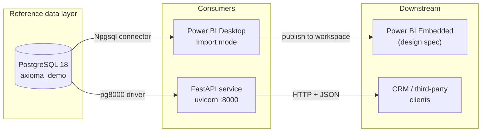

# Axioma Demo — Integration Overview

**Axioma Demo** is a self-contained reference implementation of a pharmaceutical
**master-data integration**: the kind of system that keeps a single, trusted list of
doctors, hospitals, clinics and pharmacies, and feeds that list to every other
application in the organisation.

This section documents the whole chain, from the physical database up to the
published API contract.

---

## Why this project exists

Pharmaceutical CRM platforms do not invent their own list of doctors. They subscribe
to a **reference database** — IQVIA OneKey, Veeva OpenData, or in the Ukrainian and
Central European market, **Axioma** by Proxima Research. The CRM then synchronises
against it: new professionals appear, old records are retired, affiliations change,
and field representatives submit corrections that flow back upstream.

Axioma itself is a licensed commercial product and is not publicly accessible. So
this project reconstructs the *shape* of the problem rather than the product: a
reference store with the same entities, the same identity and deduplication concerns,
the same incremental-synchronisation requirements, and the same two consumers a real
deployment has — a **BI reporting layer** and a **REST integration API**.

Everything documented here runs. Every screenshot is from the working system.

---

## Architecture

Two consumers, two integration styles, and they are deliberately different:

| | Power BI | Integration API |
|---|---|---|
| **Consumer** | human analysts | other software |
| **Coupling** | direct database connection | HTTP contract |
| **Data shape** | tabular model, whole tables | JSON resources, paginated |
| **Who may change it** | the BI author | governed by an API version |

That contrast is the point. A reporting tool is allowed to reach into the database
because a broken report is a nuisance. An external system is not, because a broken
contract is an outage.

---

## Environment

The whole stack runs on a virtualised Windows guest, which is worth stating plainly
because the ARM architecture changed two implementation decisions later on.

| Component | Version / detail |
|---|---|
| Host | macOS (Apple Silicon) |
| Virtualisation | UTM |
| Guest OS | Windows 11, **ARM64** |
| Database | PostgreSQL 18 |
| Database client | pgAdmin 4 |
| BI tool | Power BI Desktop |
| Runtime | Python 3.13.15 (arm64) |
| API framework | FastAPI 0.141.1 |
| ASGI server | uvicorn 0.52.4 |
| PostgreSQL driver | pg8000 1.31.5 |

> **Note — Why `pg8000` and not `psycopg2`**
>
> `psycopg2-binary` ships precompiled wheels for Windows x64 but not for Windows ARM64.
> On this guest it fails at install time. `pg8000` is a pure-Python driver, has no
> compiled dependency, and implements the same DB-API 2.0 interface — so the change
> costs one import line. See [Integration API](./api.mdx#driver-selection).

---

## Glossary

Reference-data work is dense with abbreviations. They are defined once here and used
without expansion elsewhere.

| Term | Expansion | Meaning in this project |
|---|---|---|
| **HCP** | Healthcare Professional | An individual practitioner — a doctor. Table `healthcare_professionals`. |
| **HCO** | Healthcare Organisation | A hospital, clinic or medical centre. Table `healthcare_organizations`. |
| **Master data** | — | The single authoritative copy of an entity, against which all systems reconcile. |
| **Reference database** | — | A commercially maintained master-data source, licensed by the pharma company. Axioma is one. |
| **Deduplication** | — | Detecting that two records describe the same real person and merging them. |
| **Incremental sync** | — | Transferring only records changed since the last run, rather than the full set. |
| **API** | Application Programming Interface | A defined way for one program to request data from another over the network. |
| **REST** | Representational State Transfer | The dominant style of web API: resources addressed by URL, standard HTTP verbs. |
| **JSON** | JavaScript Object Notation | The text format API responses are returned in. |
| **Endpoint** | — | One callable address in an API, e.g. `GET /hcp`. |
| **OpenAPI** | — | A machine-readable description of an API; the basis of the Swagger UI page. |
| **DDL** | Data Definition Language | The SQL statements that create tables and constraints. |
| **ERD** | Entity Relationship Diagram | A picture of tables and the links between them. |
| **PK / FK** | Primary Key / Foreign Key | The column identifying a row / the column pointing at another table's row. |
| **RLS** | Row-Level Security | A rule that limits which rows a given user may see. |
| **DirectQuery** | — | A Power BI mode that queries the database live instead of copying the data. |
| **Capacity** | — | Reserved, paid compute in Azure that Power BI Embedded requires. |

---

## How to read this section

| Page | What it answers |
|---|---|
| [Database Design](./database.mdx) | How the store is built: DDL, ERD, data dictionary, verification queries. |
| [Power BI Integration](./powerbi.mdx) | How a BI tool consumes it, and why Import mode was chosen. |
| [Power BI Embedded](./powerbi-embedded.mdx) | How the same report would be delivered inside a customer-facing application. |
| [Integration API](./api.mdx) | How the REST service is built and run. |
| [API Reference](./api-reference.mdx) | The endpoint contract: parameters, responses, status codes, examples. |
| [Integration Specification](./integration-spec.mdx) | How Axioma-style reference data flows into a CRM: mapping, matching, sync, errors. |

The first four pages are procedural — they tell you what to do. The last two are
reference and specification — they tell you what is true. Mixing those two registers
in one document is the most common failure in integration documentation, so they are
kept apart here.
