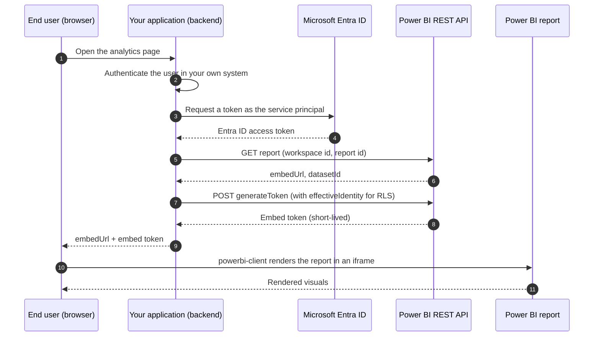

# Power BI Embedded — Integration Specification

**Status:** design specification. Not deployed.

Power BI Embedded cannot be provisioned without paid Azure capacity, so this page
specifies the integration rather than documenting a running one. Every mechanism
described is what the deployment would use; the boundary between specified and
implemented is marked rather than blurred.

---

## The problem it solves

The [Power BI report](./powerbi.mdx) built in the previous page lives in Power BI
Desktop. Delivering it to an end user means one of three things:

| Approach | Who sees it | What they need |
|---|---|---|
| Share the `.pbix` file | colleagues | Power BI Desktop installed |
| Publish to the Power BI service | internal staff | a Power BI account and licence |
| **Embed** | customers of your product | nothing — it appears inside your application |

Embedding is the option that applies when the report is part of a commercial product
and the viewers are external customers who must never see Power BI branding, never
sign in to Microsoft, and never be licensed individually.

---

## Two embedding modes

The distinction governs cost, identity and architecture, and it is decided before
anything is built.

| | **App owns data** | **User owns data** |
|---|---|---|
| Typical use | SaaS product with external customers | internal portal |
| Who authenticates to Power BI | the application, via one service identity | each end user, individually |
| End-user Power BI licence | **not required** | required (Free or Pro) |
| End user sees a Microsoft sign-in | no | yes |
| Data separation between customers | enforced by the application through RLS | enforced by Power BI permissions |
| Capacity required | yes | only for Premium features |

This specification assumes **app owns data**, which is the mode a pharmaceutical CRM
vendor would use to put dashboards in front of client organisations.

---

## Components

| Component | Role |
|---|---|
| **Microsoft Entra ID** | The identity service, formerly Azure Active Directory. Issues the token that proves the application is who it claims to be. |
| **Service principal** | A non-human identity registered in Entra ID. The application authenticates as this, not as a person. |
| **Workspace** | The container in the Power BI service holding the semantic model and report. |
| **Capacity** | Reserved compute the workspace is assigned to. Embedding requires one. |
| **Power BI REST API** | The management interface used to look up the report and mint embed tokens. |
| **Embed token** | A short-lived credential granting a single browser session access to one report. |
| **`powerbi-client`** | The JavaScript library that renders the report into a container element in the page. |

---

## Authentication and embedding flow

Three properties of this flow are the ones that matter in review:

**The end user never contacts Entra ID.** They authenticate against the application's
own login. Microsoft identity is invisible to them, which is the entire point of the
app-owns-data mode.

**The embed token is minted server-side, per session.** It is short-lived and scoped
to one report. It must never be generated in browser code, because doing so would
require shipping the service principal's credentials to the client.

**Data separation is asserted at token generation time.** The `effectiveIdentity`
passed in step 7 is what binds this session to one customer's rows. If it is omitted,
every customer sees every row.

---

## Row-level security

RLS is defined in the semantic model, not in the application. A role is created in
Power BI Desktop with a DAX filter expression, for example on the `region` column of
`healthcare_organizations`, and the role is then asserted per session.

| Step | Where | What |
|---|---|---|
| 1 | Power BI Desktop | **Modeling** → **Manage roles**; define a role with a filter expression |
| 2 | Power BI Desktop | **View as** to verify the filter returns the expected subset |
| 3 | Publish | The role travels with the semantic model |
| 4 | Application backend | Pass `effectiveIdentity` — username, roles, dataset — when generating the embed token |

> **Important — Security boundary**
>
> RLS enforced through embed tokens is only as strong as the backend that mints them.
> The application must derive the identity from its own authenticated session, never
> from a value supplied by the client. A user-controlled `effectiveIdentity` is a
> direct path to another customer's data.

---

## Licensing

This is where embedding projects most often stall, so it is stated explicitly.

| Licence / SKU | What it permits | Relevance |
|---|---|---|
| **Power BI Free** | Power BI Desktop; publishing to *My Workspace* only | What this project runs on. Cannot embed. |
| **Power BI Pro** | Shared workspaces, collaboration, publishing | Required for the developer and for user-owns-data viewers |
| **A SKU** (Azure) | Embedded capacity, billed hourly, pausable | Development and variable production load |
| **F SKU** (Microsoft Fabric) | Capacity, reserved or pay-as-you-go | The current production path |
| **EM / P SKU** | Legacy embedded and Premium capacities | Existing tenants only |

**Consequence for this project:** the account used here holds a Power BI Free licence.
That is sufficient to build the report and publish it to a personal workspace, and
insufficient to embed it anywhere. No configuration change removes that limit — it is
a commercial boundary, not a technical one.

---

## What can be verified without capacity

[playground.powerbi.com](https://playground.powerbi.com) runs the full embedding
experience against Microsoft's own sample capacity: the `powerbi-client` API surface,
report loading events, filter injection, bookmarks and export. It exercises the
client-side half of the flow without an Azure subscription.

The server-side half — service principal, tenant settings, capacity assignment,
`generateToken` — cannot be exercised without a tenant and capacity, and is therefore
specified here rather than demonstrated.

---

## Pre-deployment checklist

Conditions that must all hold before an embed attempt can succeed. Each one fails
silently or with a misleading error when missed.

| # | Condition |
|---|---|
| 1 | Service principal registered in Entra ID with a client secret or certificate |
| 2 | Tenant setting *Allow service principals to use Power BI APIs* enabled, and the principal in the permitted security group |
| 3 | Service principal added to the workspace as **Member** or **Admin** |
| 4 | Workspace assigned to an A or F capacity |
| 5 | Semantic model credentials configured in the workspace so the gateway can reach the data source |
| 6 | RLS roles defined in the model, if data separation is required |
| 7 | Embed token generated server-side, with `effectiveIdentity` derived from the application's own session |

---

## Related

- [Power BI Integration](./powerbi.mdx) — building the report this specification would embed
- [Integration Specification](./integration-spec.mdx) — how the underlying reference data is kept current
