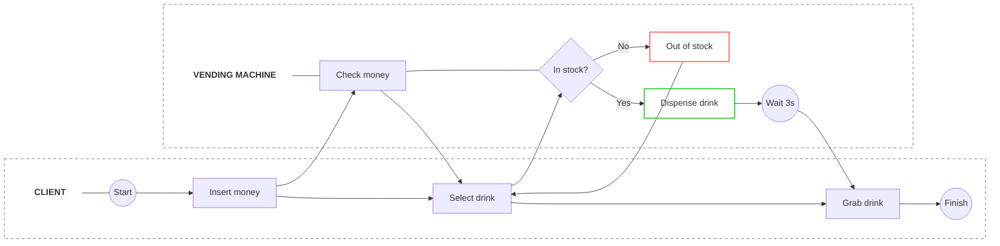

import React from 'react';
import BpmnImg from './img/bpmn.png';

export const Sparkles = ({ size = 16 }) => (
  <svg xmlns="http://www.w3.org/2000/svg" width={size} height={size} viewBox="0 0 24 24" fill="none" stroke="currentColor" strokeWidth="2" strokeLinecap="round" strokeLinejoin="round">
    <path d="m12 3 1.912 5.813a2 2 0 0 0 1.275 1.275L21 12l-5.813 1.912a2 2 0 0 0-1.275 1.275L12 21l-1.912-5.813a2 2 0 0 0-1.275-1.275L3 12l5.813-1.912a2 2 0 0 0 1.275-1.275L12 3Z"/>
    <path d="M5 3v4"/><path d="M19 17v4"/><path d="M3 5h4"/><path d="M17 19h4"/>
  </svg>
);

export const FeedbackSection = () => {
  const [feedback, setFeedback] = React.useState(null);
  return (
    

      {!feedback ? (
        

          Was this section helpful?
          <button onClick={() => setFeedback('yes')} style={{ color: '#F68B1F', fontSize: '14px', fontWeight: '600', background: 'none', border: 'none', cursor: 'pointer' }}>Yes</button>
          <button onClick={() => setFeedback('no')} style={{ color: '#F68B1F', fontSize: '14px', fontWeight: '600', background: 'none', border: 'none', cursor: 'pointer' }}>No</button>
        

      ) : feedback === 'yes' ? (
        

          ✨ Thanks for your feedback! We're glad this helped.
        

      ) : (
        

          
We're sorry! How can we improve this page?

          <textarea style={{ width: '100%', backgroundColor: '#0a0a0a', border: '1px solid #303033', borderRadius: '0.5rem', padding: '0.75rem', fontSize: '0.875rem', color: '#adadb8', outline: 'none' }} placeholder="Your feedback..." rows={4}></textarea>
          <button style={{ marginTop: '1rem', backgroundColor: '#F68B1F', color: 'white', fontSize: '0.75rem', fontWeight: 'bold', padding: '0.5rem 1rem', borderRadius: '0.5rem', border: 'none', cursor: 'pointer' }}>Submit Feedback</button>
        

      )}
      

    

  );
};

export const nodeRows = [
  { symbol: 'Start Event (Circle)', desc: 'Represents the trigger where the customer decides they want a drink.' },
  { symbol: 'Task: Insert money', desc: 'The user provides payment to the machine.' },
  { symbol: 'Task: Check money', desc: 'The system verifies the inserted amount.' },
  { symbol: 'Task: Select drink', desc: 'The user chooses a specific product.' },
  { symbol: 'Task: Notify customer', desc: 'The system informs the user if the selection is unavailable ("Out of stock").' },
  { symbol: 'Task: Dispense drink', desc: 'The mechanical process of releasing the product.' },
  { symbol: 'Task: Grab from dispenser', desc: 'The final physical interaction by the user.' },
  { symbol: 'Gateway (Diamond)', desc: 'Decision point labeled "Is the drink in stock?" — branches into Yes or No paths based on inventory status.' },
  { symbol: 'Intermediate Event', desc: 'Labeled "Wait 3 seconds", indicating a short system delay during dispensing.' },
  { symbol: 'End Event (Bold Circle)', desc: 'Marks the successful completion of the process.' },
];

export const connectionRows = [
  { type: 'Sequence Flows', desc: "Arrows defining the order of activities — e.g., the flow moves from the machine's Wait state back to the customer's Grab drink action." },
  { type: 'Conditional Flows', desc: 'The Yes/No paths from the gateway that determine the next system response based on stock availability.' },
];

  BPMN
  <code style={{ fontSize: '13px', color: '#adadb8', fontFamily: 'monospace' }}>Vending Machine Process</code>

<h1 style={{ fontSize: '2rem', fontWeight: 'bold', color: 'var(--ifm-font-color-base)', marginBottom: '1.5rem', letterSpacing: '-0.025em' }}>BPMN Diagrams</h1>

BPMN (Business Process Model and Notation) is a standard graphical representation for specifying business processes in a workflow. It provides a visual language that is easily understood by all business stakeholders, including business analysts, technical developers, and program managers.

This diagram is built using <strong style={{ color: '#e3e3e8' }}>Mermaid</strong>, a Markdown-based tool for generating charts. It can also be constructed in <strong style={{ color: '#e3e3e8' }}>Lucid.app</strong> for more advanced styling and collaborative editing.

<h2 style={{ fontSize: '20px', fontWeight: 'bold', color: 'var(--ifm-font-color-base)', marginBottom: '0.75rem', letterSpacing: '-0.02em' }}>Order Process: Vending Machine</h2>

This diagram illustrates the logical flow of a customer interacting with a vending machine to purchase a drink. It is divided into two horizontal swimlanes: <strong style={{ color: '#e3e3e8' }}>Customer</strong> and <strong style={{ color: '#e3e3e8' }}>Vending Machine</strong>, showing how responsibility shifts between the user and the system.

<h2 style={{ fontSize: '20px', fontWeight: 'bold', color: 'var(--ifm-font-color-base)', marginBottom: '0.75rem', letterSpacing: '-0.02em' }}>Nodes and symbols</h2>

  

    Symbol
    Description
  

  {nodeRows.map((row, idx) => (
    

      <code style={{ fontFamily: 'monospace', color: '#F68B1F', fontWeight: '600', fontSize: '12px' }}>{row.symbol}</code>
      {row.desc}
    

  ))}

<h2 style={{ fontSize: '20px', fontWeight: 'bold', color: 'var(--ifm-font-color-base)', marginBottom: '0.75rem', letterSpacing: '-0.02em' }}>Connections</h2>

  

    Type
    Description
  

  {connectionRows.map((row, idx) => (
    

      <code style={{ fontFamily: 'monospace', color: '#F68B1F', fontWeight: '600', fontSize: '12px' }}>{row.type}</code>
      {row.desc}
    

  ))}

<FeedbackSection />

<h3 style={{ color: 'var(--ifm-font-color-base)', fontSize: '13px', fontWeight: 'bold', textTransform: 'uppercase', letterSpacing: '0.08em', marginBottom: '0.875rem' }}>Mermaid diagram</h3>

  

    <h3 style={{ fontSize: '11px', fontWeight: 'bold', textTransform: 'uppercase', letterSpacing: '0.1em', color: '#88888f', margin: 0 }}>Lucid.app alternative</h3>
    <Sparkles size={18} />
  

  
This diagram can also be easily constructed in <strong style={{ color: '#e3e3e8' }}>Lucid.app</strong> for more advanced styling, collaborative editing, and richer export options.

<h3 style={{ color: 'var(--ifm-font-color-base)', fontSize: '13px', fontWeight: 'bold', textTransform: 'uppercase', letterSpacing: '0.08em', marginBottom: '0.875rem' }}>Lucid.app export</h3>

  

