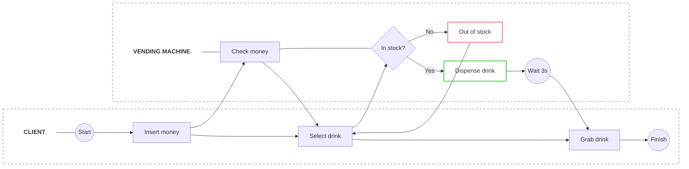
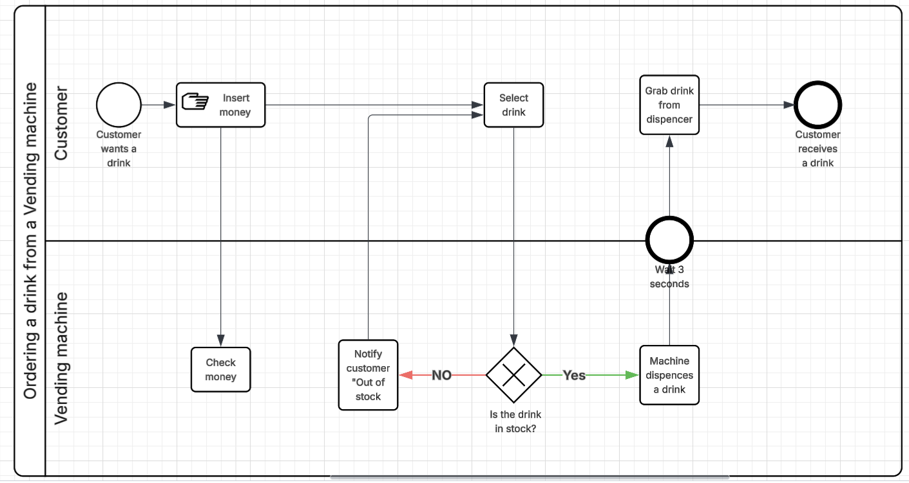

## Introduction to BPMN and Process Flow

**BPMN (Business Process Model and Notation)** is a standard graphical representation for specifying business processes in a workflow. It provides a visual language that is easily understood by all business stakeholders, including business analysts, technical developers, and program managers.

### Order Process: Vending Machine
This diagram illustrates the logical flow of a customer interacting with a vending machine to purchase a drink. It is divided into two horizontal swimlanes: **Customer** and **Vending Machine**, showing how responsibility shifts between the user and the system.

<b>Click to see the detailed explanation of the Vending Machine diagram</b>

#### Nodes and Symbols:
* **Start Event (Circle):** Represents the trigger where the customer decides they want a drink.
* **Tasks (Rectangles):**
    * **Insert money:** The user provides payment to the machine.
    * **Check money:** The system verifies the inserted amount.
    * **Select drink:** The user chooses a specific product.
    * **Notify customer "Out of stock":** The system informs the user if the selection is unavailable.
    * **Machine dispenses a drink:** The mechanical process of releasing the product.
    * **Grab drink from dispenser:** The final physical interaction by the user.
* **Gateway (Diamond):** A decision point labeled **"Is the drink in stock?"**. It branches the flow into "Yes" or "No" paths based on inventory status.
* **Intermediate Event (Double Circle):** Labeled **"Wait 3 seconds"**, indicating a short system delay during dispensing.
* **End Event (Bold Circle):** Marks the successful completion of the process.

#### Connections:
* **Sequence Flows (Arrows):** Define the order of activities. For example, the flow moves from the machine's "Wait" state back to the customer's "Grab drink" action.
* **Conditional Flows:** Specifically the **"Yes/No"** paths from the gateway that determine the next system response.

This diagram is built using **Mermaid**, a Markdown-based tool for generating charts. 

However, it can also be easily constructed in **Lucid.app** for more advanced styling and collaborative editing.

