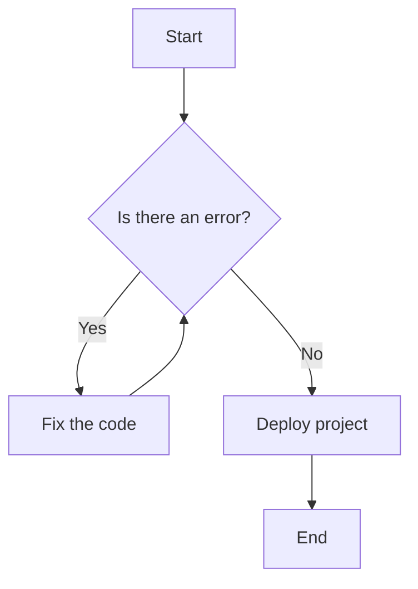
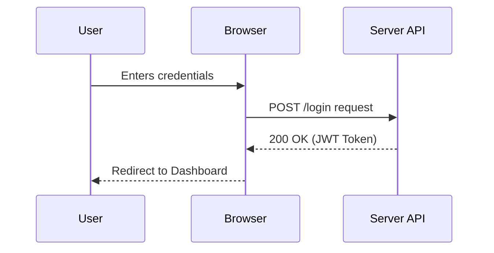
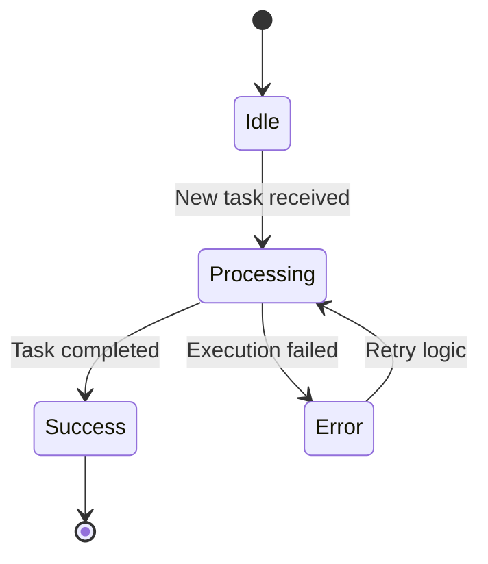

# UML Diagrams in Documentation

Unified Modeling Language (UML) is a standardized way to visualize system architecture. Using diagrams helps stakeholders and developers understand complex logic quickly without having to read hundreds of lines of text.

Below are three examples of diagrams built using **Mermaid.js**.

---

## 1. Flowchart — Basic Level
This is a fundamental example showing a logical execution path or a decision-making process. Each node has a specific shape (diamonds for conditions, rectangles for actions). It is the perfect tool for describing business logic and process flows.

Each node has a specific shape (diamonds for conditions, rectangles for actions). It is the perfect tool for describing business logic and process flows.

## 2. Sequence Diagram — Intermediate Level
This diagram illustrates how objects or services interact with each other over time. It displays the exchange of messages between different participants in the system. The vertical lines represent time moving from top to bottom.

## 3. State Diagram — Advanced Level
Used to describe the behavior of complex systems that change their state based on specific events. This scheme is indispensable for technical API documentation or order management systems where tracking transitions between statuses is critical.

