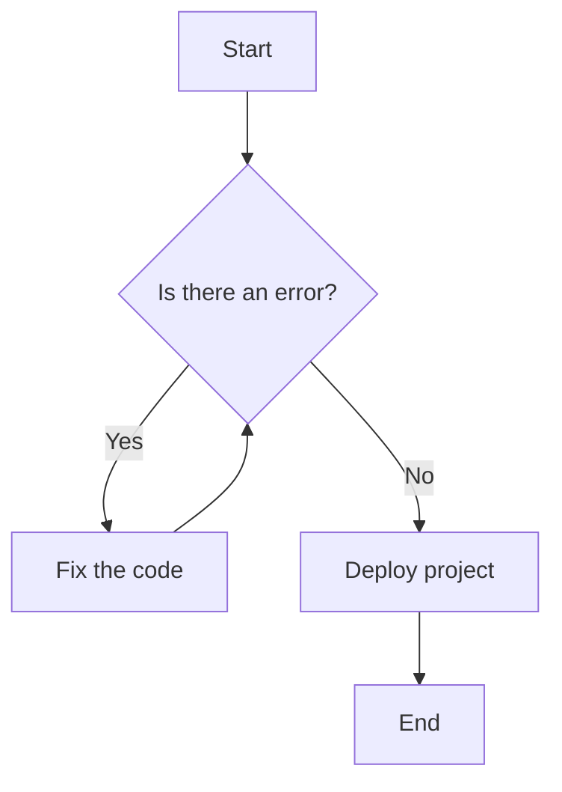
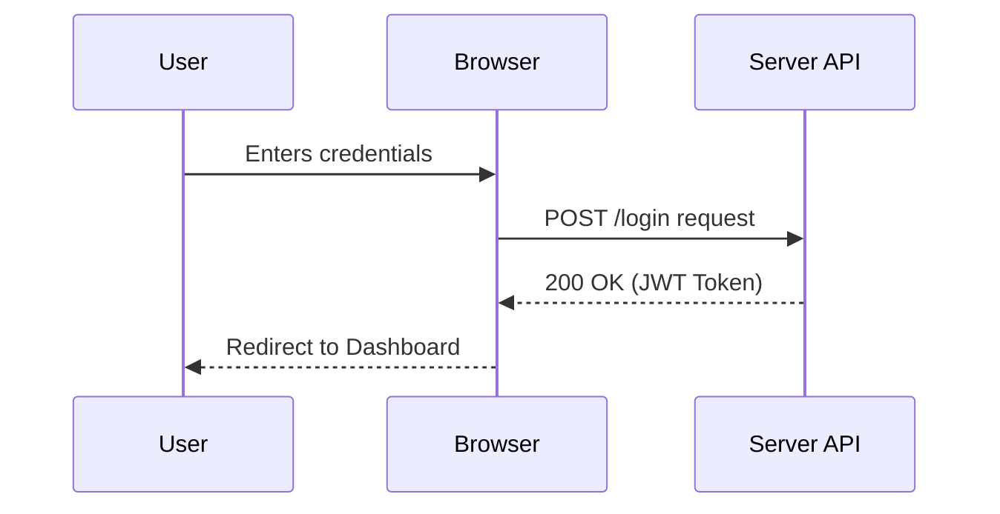
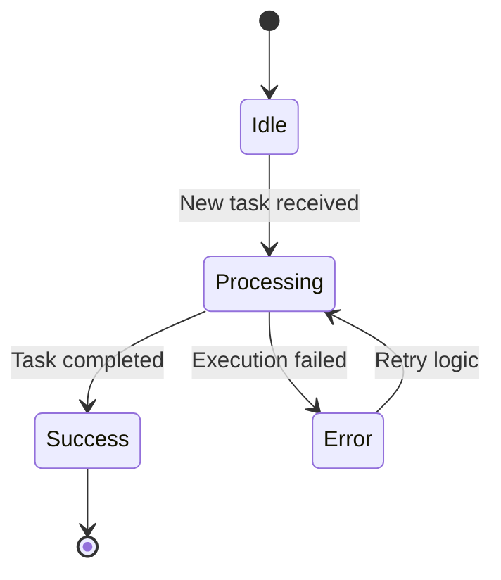
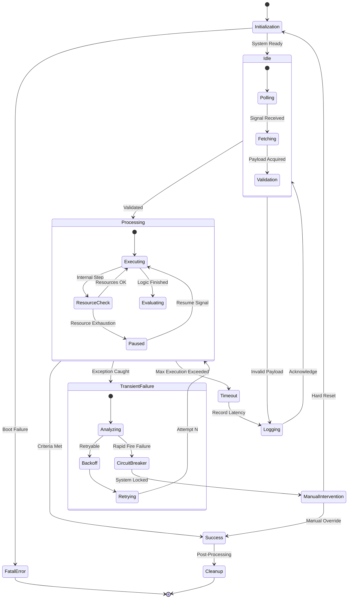

# UML Diagrams in Documentation

Unified Modeling Language (UML) is a standardized way to visualize system architecture. Using diagrams helps stakeholders and developers understand complex logic quickly without having to read hundreds of lines of text.

Below are three examples of diagrams built using **Mermaid.js**.

---

## 1. Flowchart — Basic Level
This is a fundamental example showing a logical execution path or a decision-making process. Each node has a specific shape (diamonds for conditions, rectangles for actions). It is the perfect tool for describing business logic and process flows.

<b>Click to see the detailed explanation of the Basic Flowchart</b>

### Diagram Overview
This flowchart illustrates a standard decision-making process during a development cycle. It uses standard UML shapes: **Rectangles** for actions/processes and a **Diamond** for a decision point.

### The Logic Flow

1. **Start**: The process begins at the entry point.
2. **Decision Point (`Is there an error?`)**: 
   - The system checks for the presence of bugs or configuration issues.
   - This acts as a logical gate that determines the next step based on a boolean (Yes/No) result.
3. **Branch A (`Yes` -> `Fix the code`)**: 
   - If an error is detected, the flow moves to the remediation phase. 
   - After the fix, the logic loops back to the decision point to re-verify the status.
4. **Branch B (`No` -> `Deploy project`)**: 
   - If no errors are found, the system proceeds to the deployment phase.
5. **End**: The process successfully terminates after the deployment is complete.

## 2. Sequence Diagram — Intermediate Level
This diagram illustrates how objects or services interact with each other over time. It displays the exchange of messages between different participants in the system. The vertical lines represent time moving from top to bottom.

<b>Click to see the detailed explanation of the Authentication Sequence</b>

### Participants
* **User**: The human actor interacting with the application's interface.
* **Browser**: The frontend (client-side) application that handles the UI and user input.
* **Server API**: The backend (server-side) system that manages data, logic, and authentication.

### The Step-by-Step Process

1. **User Input (`Enters credentials`)**
   The process begins when the **User** interacts with the login form. They provide their identity data. The **Browser** captures this input.

2. **Request Initiation (`POST /login request`)**
   The **Browser** packages the credentials into a secure HTTP **POST** request and sends it to the `/login` endpoint on the **Server API**.

3. **Server-Side Processing & Validation**
   The **Server API** validates the credentials. If authenticated, it generates a **JWT (JSON Web Token)** as a session key.

4. **Response (`200 OK (JWT Token)`)**
   The **Server API** sends back an HTTP **200 OK** response containing the **JWT Token**.

5. **Navigation (`Redirect to Dashboard`)**
   The **Browser** stores the token and triggers a client-side redirect, moving the **User** to the **Dashboard**.

## 3. State Diagram — Advanced Level
Used to describe the behavior of complex systems that change their state based on specific events. This scheme is indispensable for technical API documentation or order management systems where tracking transitions between statuses is critical.

<b>Click to see the detailed explanation of the State Diagram</b>

### Diagram Overview
This state diagram represents the lifecycle of a background task or a process worker. Unlike a flowchart which shows a path, a state diagram shows the different **states** a system can be in and the **events** that trigger transitions between them.

### State Transitions and Logic

1. **Initial State (Solid Circle)**: The entry point indicating where the system life cycle begins.
2. **Idle**: The default state where the system is waiting for input. It is "listening" for a trigger.
3. **Transition (`New task received`)**: An external event occurs that pushes the system out of the Idle state.
4. **Processing**: The active state where the core logic or computation is being executed.
5. **Conditional Outcomes**:
    - **Success Branch (`Task completed`)**: If the work finishes correctly, the system moves to the **Success** state and then reaches the **Final State** (double circle).
    - **Error Branch (`Execution failed`)**: If something goes wrong, the system transitions to the **Error** state.
6. **Retry Logic**: From the Error state, the system doesn't just stop. It follows the "Retry logic" path back to **Processing** to attempt the task again.

## 4. The Hyper-Complex State Machine
This model represents a resilient, distributed system capable of handling unexpected failures and edge cases.

<b>Technical Specification: Advanced State Transition Logic & Fault Tolerance</b>

### Architectural Overview
This Finite-State Machine formalizes a resilient worker lifecycle. It moves beyond simple success/failure paths to incorporate **high-availability patterns** such as resource orchestration and circuit breakers, ensuring state integrity even during infrastructure instability.

### 1. Pre-Execution & Quiescence
* **Initialization & Bootstrapping**: Upon instantiation, the system executes a self-diagnostic. A `FatalError` at this stage triggers an immediate shutdown to prevent corrupted execution.
* **Hierarchical Idle State**: The system operates in a multi-stage waiting mode, encompassing **Active Polling**, **Data Fetching**, and **Payload Validation**. This ensures the core execution state is never reached with malformed data.

### 2. Execution & Resource Orchestration
* **Processing Micro-states**: The execution phase is governed by a **ResourceCheck** loop. This prevents process hanging during CPU or memory exhaustion by transitioning to a `Paused` state until the environment stabilizes.
* **State Persistence**: Before final evaluation, the system enters an **Evaluating** state to verify that the output meets all business logic constraints.

### 3. Fault Tolerance & Exception Handling
The system distinguishes between three types of failure to optimize recovery:
* **Transient Failures**: Handled via a **Backoff & Retry** strategy, allowing for recovery from temporary network blips or database locks.
* **Timeouts**: Monitored via a dedicated latency recorder to identify performance bottlenecks in the infrastructure.
* **Circuit Breaker Logic**: If the error threshold is breached, the system "trips" the breaker, locking the state to prevent "retry storms" and transitioning to **Manual Intervention** for audit.

### 4. Deterministic Termination
* **Post-Process Cleanup**: Upon reaching `Success`, the system executes a cleanup routine to de-allocate resources before entering the terminal sink.
* **Finality Guards**: This model ensures that no process is left in a "zombie" state; every path leads to either a clean disposal or an audited manual reset.

